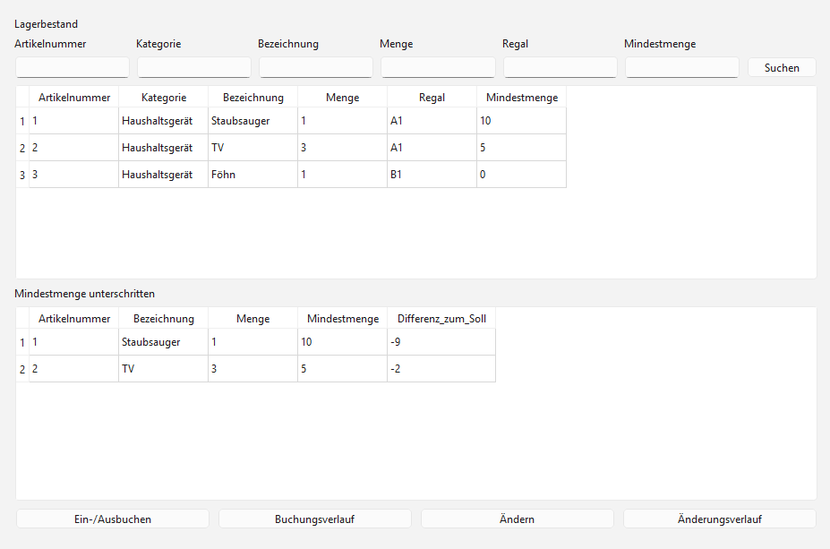
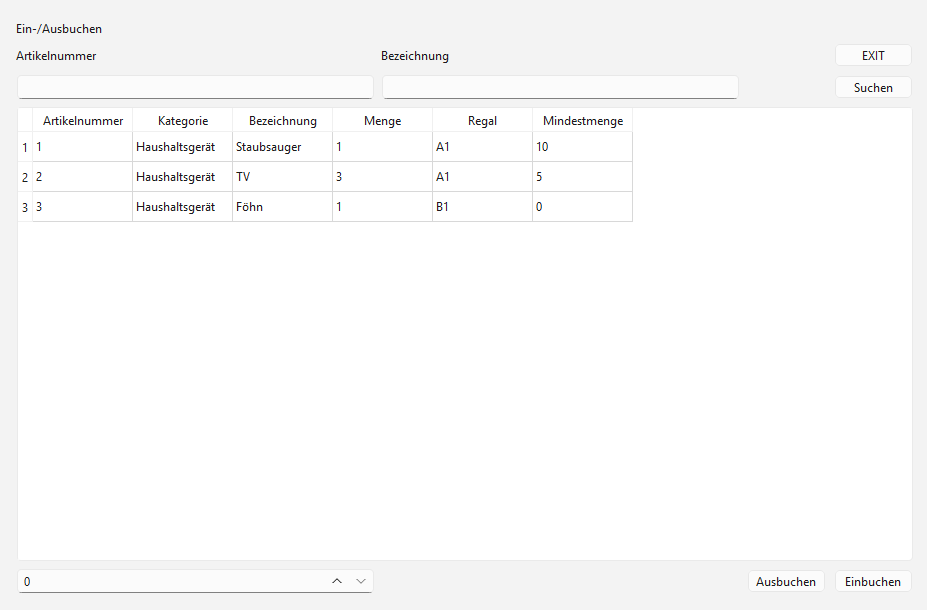
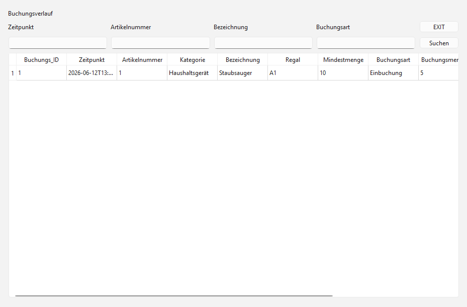
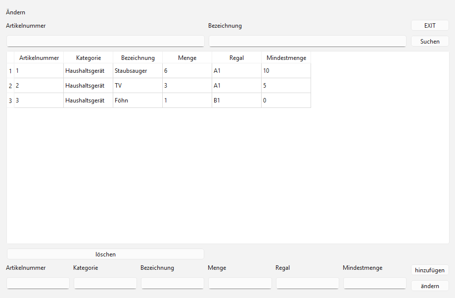
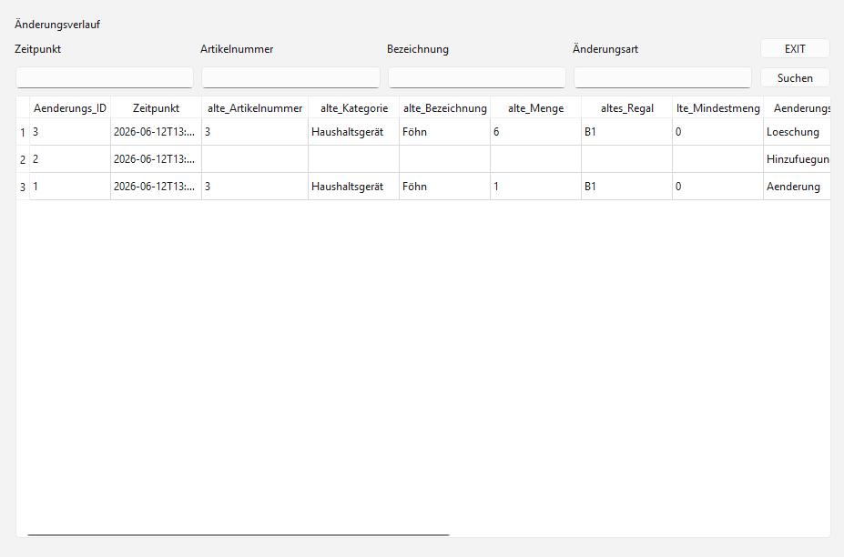

# Lagersystem

Eine Desktopanwendung zur Verwaltung eines Lagerbestands.

## Funktionen

- Suchfunktion
- Warnung bei Unterschreitung der Mindestmenge

- Ein- /Ausbuchung

- Buchungsverlauf

- Änderungen (Artikellöschung/ Veränderung /Erstellung)

- Änderungsverlauf

## Verwendete Technologien

- C++
- Qt (LGPL)
- SQLite
- Visual Studio (Community)

## Build und Ausführung

### Voraussetzungen
- **Visual Studio 2022** (mindestens Version 17.10 erforderlich für das moderne ".slnx"-Lösungsformat)
- **Qt Framework** (Version 6.11.1 mit MSVC 2022-Toolchain)
- [Qt Visual Studio Tools Extension](https://marketplace.visualstudio.com/) (für die native Integration von Qt in Visual Studio)

### Anleitung
1. Repository klonen.
2. Die Visual Studio Solution-Datei ("Lagersystem.slnx") in Visual Studio öffnen.
3. Den Qt-Pfad über die *Qt Visual Studio Tools* (Erweiterungen -> Qt VS Tools -> Qt Options) überprüfen, falls die Pfade auf dem Zielsystem abweichen.
4. Das Projekt im Modus "Release" oder "Debug" bauen und starten.

*Hinweis: Eine SQLite-Beispieldatenbank wird beim ersten Programmstart automatisch im Ausführungsverzeichnis erstellt.*

### Compiler-Hinweis (Warnung C4996)
In den Projekteigenschaften wurde die Warnung **C4996** deaktiviert. 

Das verwendete Qt 6 Framework nutzt intern Funktionen, die in einer zukünftigen Version (Qt 7) entfernt werden. Visual Studio wertet solche Hinweise standardmäßig als Fehler und bricht den Start ab. Da dieser Code direkt von Qt stammt und die Anwendung unter Qt 6 stabil läuft, wurde die Warnung abgeschaltet, damit das Projekt problemlos gebaut werden kann.

## Design

**Entwurfsmuster: angelehnt an Model View Controller**

In der "Lagersystem.cpp" werden alle "View-Elemente" mit den Datenmodellen verknüpft, sowie die Benutzereingaben an die Controller-Funktionen der "LogicController.cpp" übergeben. 
Die "Lagersystem.cpp" entspricht dem View Teil und verknüpft die View mit den Datenmodellen. 
Die "LogicController.cpp" entspricht dem Controller Teil. Qt realisiert die Verknüpfung der Datenbank mit dem Modell über ein QSqlQueryModel.

**Warum angelehnt an Model View Controller**

Einfaches und übersichtliches Entwurfsmodell, durch das eine einfache Wartbarkeit (Trennung von View und Controller) und einfache Lesbarkeit gewährleistet wird.

**Datenbankabfragen abgesichert gegen SQL-Injections**

Bei SQL-Befehlen, die von Benutzereingaben abhängen, werden die Benutzereingaben über "bindValue" mit "Prepared-Statements" verknüpft.
Dadurch sind Benutzereingaben nur Vergleichswerte und nie Teil des SQL-Befehls.

**QSqlQueryModel und QSqlQuery abfragen statt QSqlTableModel**

QSqlQuery lässt reine SQL-Abfragen zu. Die Änderungen sollen im LogicController ablaufen (eigene Validierung, Fehlerbehandlung und Verlaufserstellung).
QSqlQueryModel ist read-only, so kann der Nutzer keine Daten in der View (am LogicController vorbei) ändern.

**Verlaufstabellen werden vollständig separat abgespeichert** 

Statt nur einen Zeitpunkt und eine Artikelnummer-Referenz zu speichern und in der Ansicht über SQL-JOIN zu verknüpfen, werden alle Attribute in den Verlaufstabellen gespeichert (Snapshot).
So wird sichergestellt, dass auch bei Artikeländerungen die Daten konsistent bleiben.

## Lizenz

Dieses Projekt steht unter der **MIT-Lizenz** – siehe die [LICENSE](LICENSE)-Datei für Details. 
Die Nutzung des Qt Frameworks erfolgt im Rahmen der LGPLv3 (dynamische Verlinkung).
